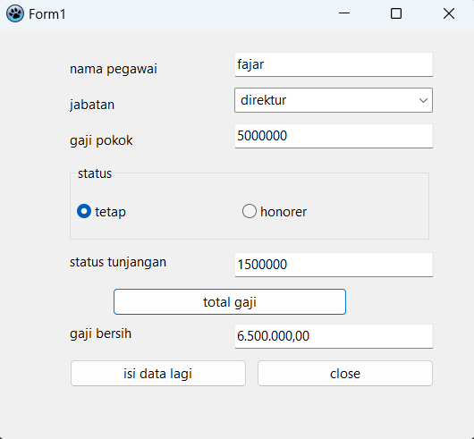
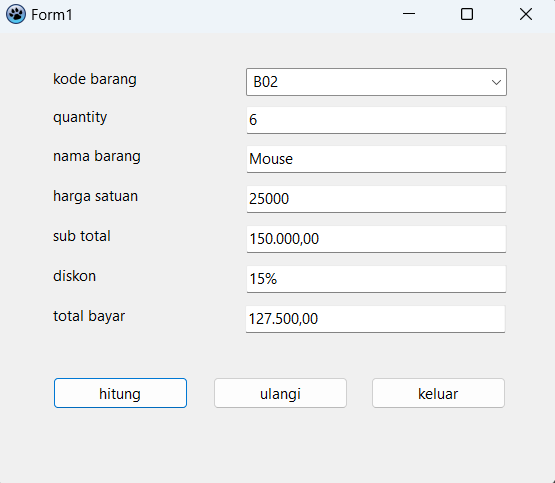

| Nama           | Fajar Agung Nugroho           |
| -------------- | ----------------------------- |
| NIM            | 312010448                     |
| Kelas          | TI.20.A.RPL-1                 |
| Mata Kuliah    | Pemrograman Visual            |
| Dosen Pengampu | Agung Nugroho, S.Kom., M.Kom. |

## 1. Program Menghitung Gaji Karyawan

Hitung gaji pegawai dengan jabatan direktur dengan status tetap, \*berlaku juga untuk lainnya

[Download](https://github.com/fajarspace/Lat2Visual/releases)

## 2. Program Penjualan Barang

Hitung penjualan barang dengan ketentuan:

- Data yang diinputkan hanya kode barang dan quantity.
- Quantity pembelian tidak boleh lebih dari 10.
- Data yang dimasukan harus divalidasi.

[Download](https://github.com/fajarspace/Lat2Visual/releases)
